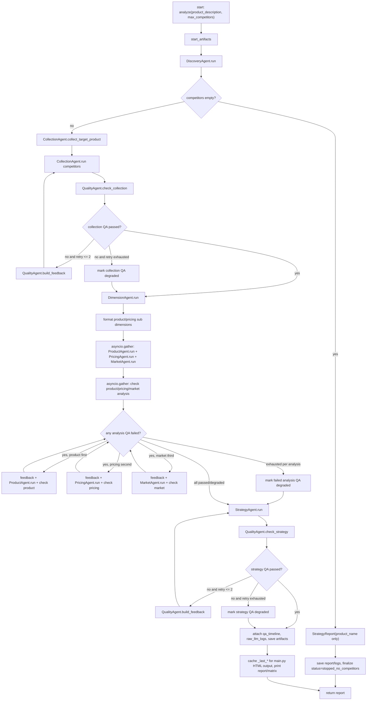
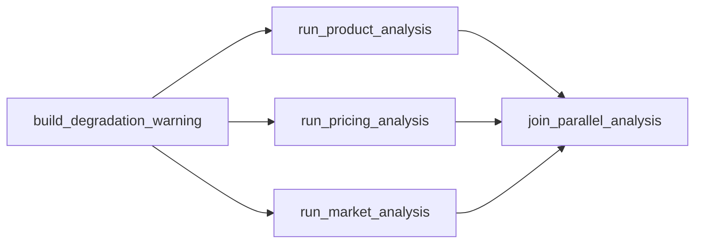
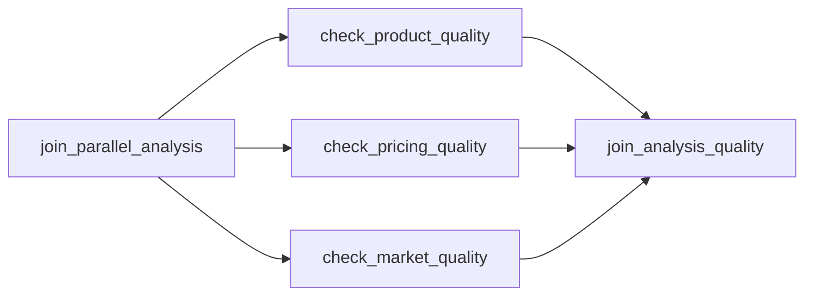
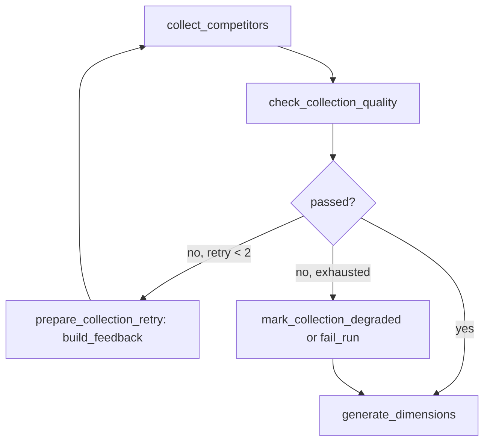
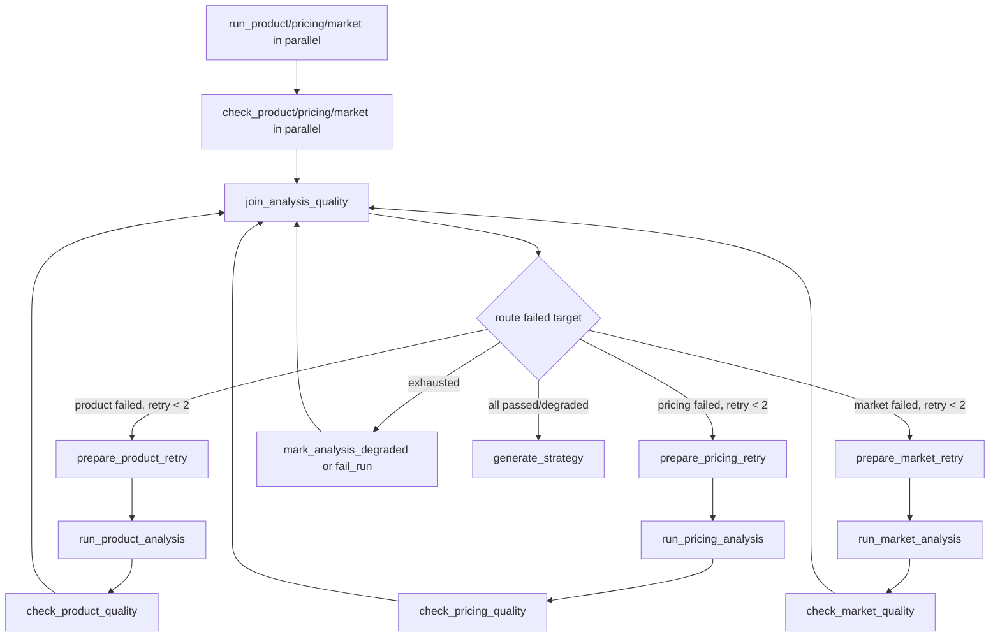
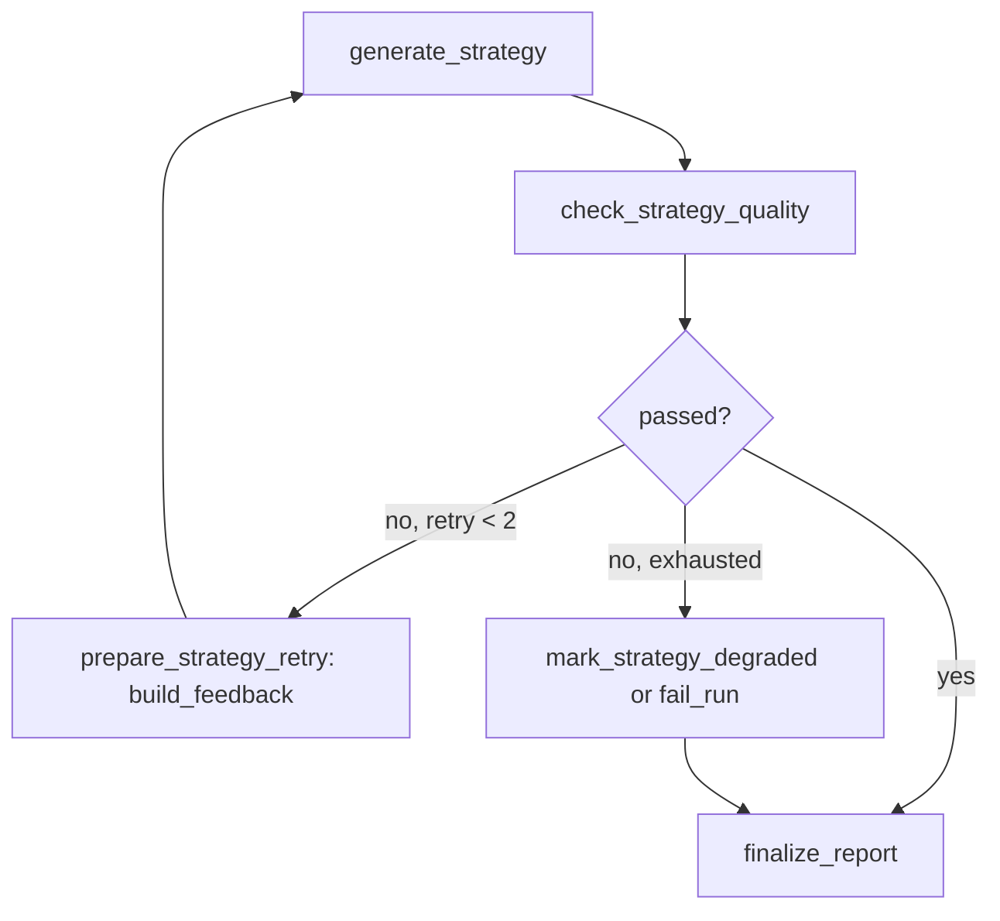

# LangGraph 编排层迁移计划

## 目标与边界

目标是在尽可能保持现有业务行为不变的前提下，用 LangGraph 的 Graph API 和 `StateGraph` 重写多 Agent 编排层，把当前集中在 `core/orchestrator.py::Orchestrator.analyze()` 中的固定流程迁移为显式状态图。

本计划阶段只分析和设计，不修改业务代码。后续实施仍需遵守：

- 保留现有 `agents/*`、`models/domain.py`、`prompts/*.md` 的业务语义。
- 不替换 Doubao LLM，不新增 Supervisor Agent，不改造成自主规划型 Agent。
- 不改变最终 HTML 和 JSON 报告格式。
- 不重构与 LangGraph 编排迁移无关的代码。

## 已检查范围

已阅读：

- 根目录：`README.md`、`requirements.txt`、`main.py`、`config.py`、`AGENTS.md`
- 核心模块：`core/orchestrator.py`、`core/llm_client.py`、`core/search_client.py`、`core/prompt_loader.py`、`core/artifact_store.py`
- 全部 Agent：`agents/base_agent.py`、`discovery_agent.py`、`collection_agent.py`、`dimension_agent.py`、`product_agent.py`、`pricing_agent.py`、`market_agent.py`、`quality_agent.py`、`strategy_agent.py`
- 模型：`models/domain.py`
- 全部 prompt：`prompts/*.md`
- 脚本：`scripts/generate_prompt_examples.py`
- 测试目录：`tests/`

现状差异：

- `tests/` 目录当前只有 `__pycache__`，没有可读测试源码。
- `workflow/` 目录当前只有 `__pycache__`，没有可读源码；说明曾经可能有 workflow 实现，但当前仓库没有可维护的 LangGraph 源码。
- `requirements.txt` 当前只有 `requests>=2.28.0`，未包含 `langgraph`。
- 当前质检超过最大重试次数后的行为是“降级通过并继续生成报告”，不是硬失败终止。
- 当前目标产品采集没有单独质检；采集质检只检查 `competitors_data`。
- 当前三类分析初次执行是 `asyncio.gather` 并发，初次分析质检也是 `asyncio.gather` 并发；但质检失败后的 Product/Pricing/Market 重做循环按 product、pricing、market 顺序串行处理。

## 当前目录结构

```text
G:\SmartComp_Engine
├── agents/
│   ├── base_agent.py
│   ├── discovery_agent.py
│   ├── collection_agent.py
│   ├── dimension_agent.py
│   ├── product_agent.py
│   ├── pricing_agent.py
│   ├── market_agent.py
│   ├── quality_agent.py
│   └── strategy_agent.py
├── core/
│   ├── artifact_store.py
│   ├── llm_client.py
│   ├── orchestrator.py
│   ├── prompt_loader.py
│   └── search_client.py
├── models/
│   └── domain.py
├── prompts/
│   ├── collection_agent.md
│   ├── dimension_agent.md
│   ├── discovery_agent.md
│   ├── market_agent.md
│   ├── pricing_agent.md
│   ├── product_agent.md
│   ├── quality_agent.md
│   ├── strategy_agent.md
│   └── examples/*.json
├── scripts/
│   └── generate_prompt_examples.py
├── tests/
│   └── __pycache__/ only
├── workflow/
│   └── __pycache__/ only
├── output/
├── main.py
├── config.py
├── requirements.txt
└── README.md
```

## 现有 Agent 职责

| Agent | 文件 | 职责 | 主要外部依赖 |
|---|---|---|---|
| `BaseAgent` | `agents/base_agent.py` | 统一 Agent ID、日志、LLM 调用、JSON 解析、引用 ID 提取 | `core.llm_client` |
| `DiscoveryAgent` | `agents/discovery_agent.py` | 为产品生成搜索关键词，联网搜索并筛选竞品列表 | `SearchClient`、`prompts/discovery_agent.md` |
| `CollectionAgent` | `agents/collection_agent.py` | 采集目标产品和每个竞品的功能、定价、市场、评价、渠道、引用来源 | `SearchClient`、`prompts/collection_agent.md` |
| `DimensionAgent` | `agents/dimension_agent.py` | 根据产品和竞品推断品类，生成产品/定价动态子维度 | `prompts/dimension_agent.md` |
| `ProductAgent` | `agents/product_agent.py` | 基于采集数据生成产品功能矩阵、竞争优劣势和差异化点 | `prompts/product_agent.md` |
| `PricingAgent` | `agents/pricing_agent.py` | 基于采集数据生成定价对比、定价策略分析、性价比排名 | `prompts/pricing_agent.md` |
| `MarketAgent` | `agents/market_agent.py` | 基于采集数据生成市场份额、增长趋势、用户口碑、用户画像、渠道分析 | `prompts/market_agent.md` |
| `QualityAgent` | `agents/quality_agent.py` | 对采集、三类分析、最终策略做完整性、幻觉、引用检查，并生成反馈 | `prompts/quality_agent.md` |
| `StrategyAgent` | `agents/strategy_agent.py` | 汇总三类分析，生成 `StrategyReport`，并负责文本/HTML 报告格式化 | `prompts/strategy_agent.md` |

## Agent 输入、输出和依赖关系

| 节点/Agent | 输入 | 输出 | 依赖 |
|---|---|---|---|
| `DiscoveryAgent.run` | `product_description`, `max_competitors` | `CompetitorList` | Doubao LLM、Doubao Responses web search；失败时规则关键词/规则筛选 |
| `CollectionAgent.collect_target_product` | `product_description`, `competitor_list.product_name`, `feedback=""` | `CompetitorData` | Doubao web search + LLM 汇总；失败时规则 `CompetitorData` |
| `CollectionAgent.run` | `product_description`, `CompetitorList`, `feedback=""` | `dict[str, CompetitorData]` | 逐竞品搜索和汇总；缓存 `_last_search_texts` |
| `QualityAgent.check_collection` | `competitors_data`, `original_search_texts`, `competitor_list`, `attempt` | `QualityCheckResult` | 规则完整性 + LLM 幻觉检测 + 规则引用有效性 |
| `DimensionAgent.run` | `product_description`, `CompetitorList` | `DimensionConfig` | LLM 或默认维度 |
| `ProductAgent.run` | `product_name`, `competitors_data`, `target_product_data`, `product_sub_dims_text`, `feedback` | `ProductAnalysis` | LLM 或规则分析 |
| `PricingAgent.run` | `product_name`, `competitors_data`, `target_product_data`, `pricing_sub_dims_text`, `feedback` | `PricingAnalysis` | LLM 或规则分析 |
| `MarketAgent.run` | `product_name`, `competitors_data`, `target_product_data`, `feedback` | `MarketAnalysis` | LLM 或规则分析 |
| `QualityAgent.check_analysis` | `analysis_type`, analysis object, `competitors_data`, `attempt` | `QualityCheckResult` | 规则完整性 + LLM 幻觉检测 |
| `StrategyAgent.run` | `product_name`, competitor count, 三类分析, `target_product_data`, `competitors_data`, `feedback` | `StrategyReport` | LLM 或规则策略；构建 `CitationIndex` |
| `QualityAgent.check_strategy` | `StrategyReport`, 三类分析, `attempt` | `QualityCheckResult` | 规则完整性 + LLM 幻觉检测 |
| `StrategyAgent.format_html_report` | `StrategyReport`, 三类分析, 竞品列表/数据, timings | HTML string | 最终报告格式，迁移时保持不变 |

## 当前编排流程



## 迁移后的 LangGraph 设计

### 设计原则

- `StateGraph` 表达固定工作流，不引入 Supervisor Agent 或自主规划。
- 节点只封装现有 Agent 调用、artifact 保存、timing 记录和路由状态更新，不改 Agent 内部业务逻辑。
- `Orchestrator` 保留为外部 API facade：`main.py` 继续调用 `Orchestrator().analyze(...)`，`strategy_agent.format_html_report(...)` 的调用方式保持兼容。
- Agent 实例、ArtifactStore 和打印/日志方法建议由 graph factory 闭包持有，不直接放入可序列化业务 state；state 只放业务产物、计数器、质量结果、状态和错误。
- 并发保持在图中显式表达：Product/Pricing/Market 三个分析节点从同一上游 fan-out，并在 join 节点汇合。
- 按当前目标要求，质检重试耗尽后进入结构化失败出口；state 中显式记录 `quality_exhausted`、最近一次反馈和失败摘要。

### 新图节点

| 节点名 | 职责 | 主要 state 输入 | 主要 state 输出 |
|---|---|---|---|
| `initialize_run` | 初始化 artifacts、timings、run meta | `product_description`, `max_competitors` | `run_dir`, `status="running"` |
| `discover_competitors` | 调用 `DiscoveryAgent.run` | product input | `competitor_list`, `product_name`, `timings.discovery` |
| `finalize_no_competitors` | 保存空报告并终止 | `competitor_list` | `report`, `status="stopped_no_competitors"` |
| `collect_target_product` | 调用目标产品采集 | product input, `product_name` | `target_product_data`, `timings.target_collection` |
| `collect_competitors` | 调用竞品数据采集 | `competitor_list`, `collection_feedback` | `competitors_data`, `original_search_texts`, `timings.collection` |
| `check_collection_quality` | 调用采集质检 | `competitors_data`, `original_search_texts` | `qa_collection`, append collection QA |
| `prepare_collection_retry` | 构造反馈并递增采集 retry | `qa_collection` | `collection_feedback`, `collection_retry_count` |
| `mark_collection_degraded` | 标记采集质检耗尽 | `qa_collection` | `qa_collection.degraded=True`, `quality_exhausted.collection=True` |
| `generate_dimensions` | 调用 `DimensionAgent.run` | product input, `competitor_list` | `dimension_config`, `product_sub_dims_text`, `pricing_sub_dims_text` |
| `build_degradation_warning` | 根据降级采集 QA 生成分析提示 | `qa_collection` | `degradation_warning` |
| `run_product_analysis` | 调用 `ProductAgent.run` | data + product dims + feedback | `product_analysis`, `timings.product_analysis` |
| `run_pricing_analysis` | 调用 `PricingAgent.run` | data + pricing dims + feedback | `pricing_analysis`, `timings.pricing_analysis` |
| `run_market_analysis` | 调用 `MarketAgent.run` | data + feedback | `market_analysis`, `timings.market_analysis` |
| `join_parallel_analysis` | 汇合三类分析并记录总耗时 | three analyses | `timings.parallel_analysis` |
| `check_product_quality` | 调用 product QA | `product_analysis`, `competitors_data` | `qa_product` |
| `check_pricing_quality` | 调用 pricing QA | `pricing_analysis`, `competitors_data` | `qa_pricing` |
| `check_market_quality` | 调用 market QA | `market_analysis`, `competitors_data` | `qa_market` |
| `join_analysis_quality` | 固定顺序合并 QA 时间线 | `qa_product`, `qa_pricing`, `qa_market` | append QA checks, `timings.qa_analysis` |
| `prepare_product_retry` | 构造 product feedback 并递增 retry | `qa_product` | `product_feedback`, `product_retry_count` |
| `prepare_pricing_retry` | 构造 pricing feedback 并递增 retry | `qa_pricing` | `pricing_feedback`, `pricing_retry_count` |
| `prepare_market_retry` | 构造 market feedback 并递增 retry | `qa_market` | `market_feedback`, `market_retry_count` |
| `mark_analysis_degraded` | 标记对应分析质检耗尽 | failed QA | degraded flag + `quality_exhausted.analysis[...]` |
| `generate_strategy` | 调用 `StrategyAgent.run` | three analyses + feedback | `report`, `timings.strategy` |
| `check_strategy_quality` | 调用最终报告质检 | `report`, three analyses | `qa_strategy` |
| `prepare_strategy_retry` | 构造 strategy feedback 并递增 retry | `qa_strategy` | `strategy_feedback`, `strategy_retry_count` |
| `mark_strategy_degraded` | 标记策略质检耗尽 | `qa_strategy` | `qa_strategy.degraded=True`, `quality_exhausted.strategy=True` |
| `finalize_report` | 附加 QA timeline、LLM logs、保存 artifacts、缓存 `_last_*` | all outputs | final `report`, `status="completed"` or `"completed_degraded"` |
| `fail_run` | 明确失败出口，保存错误和已产生 artifacts | `error`, `quality_exhausted` | `status="failed"` |

### 条件边

| 源节点 | 路由函数 | 条件 | 目标 |
|---|---|---|---|
| `discover_competitors` | `route_after_discovery` | `not competitor_list.competitors` | `finalize_no_competitors` |
| `discover_competitors` | `route_after_discovery` | has competitors | `collect_target_product` |
| `check_collection_quality` | `route_collection_qa` | passed | `generate_dimensions` |
| `check_collection_quality` | `route_collection_qa` | failed and retry count < `MAX_RETRIES` | `prepare_collection_retry` |
| `check_collection_quality` | `route_collection_qa` | failed and exhausted, default behavior | `mark_collection_degraded` |
| `check_collection_quality` | `route_collection_qa` | failed and exhausted, hard-fail enabled | `fail_run` |
| `prepare_collection_retry` | static | after feedback | `collect_competitors` |
| `join_analysis_quality` | `route_analysis_qa` | product failed and retry available | `prepare_product_retry` |
| `join_analysis_quality` | `route_analysis_qa` | pricing failed and retry available | `prepare_pricing_retry` |
| `join_analysis_quality` | `route_analysis_qa` | market failed and retry available | `prepare_market_retry` |
| `join_analysis_quality` | `route_analysis_qa` | failures exhausted | `mark_analysis_degraded` |
| `join_analysis_quality` | `route_analysis_qa` | all passed/degraded | `generate_strategy` |
| `prepare_product_retry` | static | after feedback | `run_product_analysis` then product QA path |
| `prepare_pricing_retry` | static | after feedback | `run_pricing_analysis` then pricing QA path |
| `prepare_market_retry` | static | after feedback | `run_market_analysis` then market QA path |
| `check_strategy_quality` | `route_strategy_qa` | passed | `finalize_report` |
| `check_strategy_quality` | `route_strategy_qa` | failed and retry count < `MAX_RETRIES` | `prepare_strategy_retry` |
| `check_strategy_quality` | `route_strategy_qa` | failed and exhausted, default behavior | `mark_strategy_degraded` |
| `check_strategy_quality` | `route_strategy_qa` | failed and exhausted, hard-fail enabled | `fail_run` |

### 并发分支

Product/Pricing/Market 分析保持 fan-out：



初次三类分析质检也可以保持 fan-out，但为了复刻当前 timeline 顺序，合并节点必须按 product、pricing、market 固定顺序写入 QA timeline：



失败重试默认按当前代码顺序处理：先 product，再 pricing，再 market。这样最接近现有 `for [(product),(pricing),(market)]` 循环的调用顺序。

## 统一 AnalysisState 设计

建议新增 `workflow/state.py`，定义 `AnalysisState`。优先使用 `TypedDict`，便于 LangGraph 合并 state；复杂 dataclass 继续使用现有 domain model。

```python
from typing import TypedDict, NotRequired, Literal

class AnalysisState(TypedDict, total=False):
    # 输入
    product_description: str
    max_competitors: int
    fail_on_quality_exhausted: bool

    # 运行状态
    status: Literal["running", "stopped_no_competitors", "completed", "completed_degraded", "failed"]
    error: str
    run_dir: str
    timings: dict[str, float]

    # 核心业务产物
    product_name: str
    competitor_list: CompetitorList
    target_product_data: CompetitorData
    competitors_data: dict[str, CompetitorData]
    original_search_texts: dict[str, str]
    dimension_config: DimensionConfig
    product_sub_dims_text: str
    pricing_sub_dims_text: str
    degradation_warning: str

    # 三维分析
    product_analysis: ProductAnalysis
    pricing_analysis: PricingAnalysis
    market_analysis: MarketAnalysis

    # 最终产物
    report: StrategyReport
    raw_llm_logs: list[dict]

    # QA 结果与反馈
    qa_collection: QualityCheckResult
    qa_product: QualityCheckResult
    qa_pricing: QualityCheckResult
    qa_market: QualityCheckResult
    qa_strategy: QualityCheckResult
    qa_checks: list[QualityCheckResult]
    collection_feedback: str
    product_feedback: str
    pricing_feedback: str
    market_feedback: str
    strategy_feedback: str

    # 重试计数：表示“重做次数”，不是检查 attempt
    collection_retry_count: int
    product_retry_count: int
    pricing_retry_count: int
    market_retry_count: int
    strategy_retry_count: int

    # 质检耗尽标记
    quality_exhausted: dict[str, bool]
```

字段说明：

- `product_description`、`max_competitors`：入口参数。
- `fail_on_quality_exhausted`：默认 `True`，用于质检耗尽后进入 `fail_run`；保留字段便于后续兼容旧降级语义。
- `status`、`error`：显式终态和错误原因。
- `run_dir`、`timings`：维持现有归档和耗时统计。
- `competitor_list`、`target_product_data`、`competitors_data`、`dimension_config`、三类 analysis、`report`：现有 pipeline 的业务产物。
- `original_search_texts`：来自 `CollectionAgent.get_search_texts()`，供采集幻觉检测。
- `product_sub_dims_text`、`pricing_sub_dims_text`：由 `Orchestrator._format_sub_dimensions` 等价逻辑生成，用于 prompt 注入。
- `degradation_warning`：采集质检降级后传给三类分析 Agent 的警告。
- `qa_*`：最近一次对应阶段质检结果。
- `qa_checks`：最终转换成 `QATimeline.checks` 的有序列表。
- `*_feedback`：QualityAgent 反馈，定向传回对应 Agent。
- `*_retry_count`：每个回路的重做次数，上限为 `QualityAgent.MAX_RETRIES`。
- `quality_exhausted`：记录哪个阶段耗尽，用于最终 `failed` 判断和结构化失败输出。

## 文件保留、新增与修改

保留不改业务语义：

- `agents/*.py`
- `models/domain.py`
- `prompts/*.md`
- `core/llm_client.py`
- `core/search_client.py`
- `core/prompt_loader.py`
- `core/artifact_store.py`
- `agents/strategy_agent.py::format_html_report`

建议新增：

- `workflow/__init__.py`
- `workflow/state.py`：`AnalysisState`、状态工具函数。
- `workflow/nodes.py`：每个 LangGraph 节点函数，调用现有 Agent。
- `workflow/graph.py`：`StateGraph` 构建、条件边、compile。
- `tests/test_langgraph_equivalence.py`：行为等价测试。
- `tests/test_langgraph_quality_retries.py`：质检回路和最大重试测试。
- `tests/test_langgraph_parallelism.py`：三类分析并发测试。

建议修改：

- `requirements.txt`：新增 `langgraph`。若后续测试使用 pytest，还需新增 `pytest`。
- `core/orchestrator.py`：保留 `Orchestrator` facade、Agent 属性、`get_timings()`、`print_stats()`、`_last_*` 兼容字段；将 `analyze()` 主体委托给 `workflow.graph.run_analysis_graph(...)`。
- 可选：把 artifact/timing 辅助方法保留在 `Orchestrator` 中，由 graph nodes 通过闭包调用，减少迁移面。

不建议修改：

- `main.py`：入口和报告保存逻辑可以保持不变。
- `prompts/*.md`：不改业务 prompt。
- `StrategyAgent.format_html_report()`：保持 HTML 格式等价。

## 质检失败后的定向重试回路

采集质检回路：



三类分析质检回路：



策略质检回路：



## 最大重试次数

沿用当前 `QualityAgent.MAX_RETRIES = 2`。语义定义为“重做次数”，因此每个阶段最多 3 次质检：

- 第 1 次：初次产物质检。
- 第 2 次：第 1 次打回重做后的质检。
- 第 3 次：第 2 次打回重做后的质检。

建议字段：

- `collection_retry_count <= 2`
- `product_retry_count <= 2`
- `pricing_retry_count <= 2`
- `market_retry_count <= 2`
- `strategy_retry_count <= 2`

当前图路径行为：

- 重试耗尽后设置对应 `QualityCheckResult.degraded = True` 作为质检结果标记。
- `quality_exhausted[phase] = True`。
- 路由到 `fail_run`，保存已有 artifacts、QA timeline、LLM logs、最近一次反馈和结构化失败状态。
- 不伪造完整成功报告，不继续生成后续业务阶段。

## 异常处理机制区分

| 机制 | 当前位置 | 触发条件 | 处理方式 | LangGraph 迁移策略 |
|---|---|---|---|---|
| 临时接口异常自动重试 | `core/llm_client._call_doubao` | API 4xx/错误响应、timeout、connection error | Doubao chat completion 最多 2 次尝试，失败返回空字符串 | 保持在 LLM client 内，不在图层重复包裹，避免双重重试改变行为 |
| 搜索接口异常容错 | `core/search_client.batch_search` | 单条 search 失败 | 记录 `error`，该 query result 为 `None`，批量继续 | 保持 SearchClient 行为，图层只消费 Agent 输出 |
| JSON 解析失败 fallback | `BaseAgent.ask_llm_json`、`llm_client.parse_llm_json` | LLM 返回文本但无法解析 JSON | 记录 parse_error，Agent 降级到规则引擎 fallback | 保持在 Agent 内部，不把 parse failure 建模成图异常 |
| QualityAgent 判定不合格后的图回路 | `core/orchestrator.py` while/for loops | `QualityCheckResult.passed == False` | build feedback，定向打回对应 Agent 重做 | 用条件边显式表达 collection/product/pricing/market/strategy 定向回路 |
| 超过最大重试次数 | 当前为降级通过 | failed QA 且重做次数达到 2 | 当前设置 `degraded=True` 并继续 | 默认保留降级继续；另设 `fail_run` 作为可选 hard-fail 出口 |
| 无竞品 | `Orchestrator.analyze` | `competitor_list.competitors` 为空 | 返回空 `StrategyReport`，status=`stopped_no_competitors` | 保留为独立终止分支 `finalize_no_competitors` |

## 行为等价测试设计

建议先补测试，再改编排。

1. `test_no_competitors_stops_early`
   - fake `DiscoveryAgent.run` 返回空 `CompetitorList`。
   - 断言不会调用 collection/dimension/analysis/strategy。
   - 断言 report 只有 product_name，状态为 `stopped_no_competitors`。

2. `test_happy_path_call_order_and_outputs`
   - 注入 fake agents，全部 QA 通过。
   - 断言输出 `StrategyReport` 与旧 orchestrator 等价。
   - 断言保存 artifact 名称保持：`00_target_product_data.json` 到 `07_strategy_report.json`、`qa_timeline.json`、`llm_logs.json`。

3. `test_rule_mode_report_shape`
   - `config.ENABLE_LLM=False`。
   - 运行迁移前/迁移后流程，比较 `to_jsonable(report)` 的关键字段、`qa_timeline`、`competitor_count`、`target_product_data` 是否一致。

4. `test_collection_quality_retry_feedback`
   - fake QA 第一次 collection failed，第二次 passed。
   - 断言 `CollectionAgent.run` 被调用 2 次，第二次收到 `feedback`。
   - 断言 QA timeline 记录两次 collection check。

5. `test_analysis_quality_retry_is_targeted`
   - fake product QA failed，pricing/market passed。
   - 断言只重跑 `ProductAgent.run`，不重跑 pricing/market。
   - 断言重试顺序仍为 product 优先。

6. `test_strategy_quality_retry_feedback`
   - fake strategy QA failed once then passed。
   - 断言 `StrategyAgent.run` 第二次收到 strategy feedback。

7. `test_quality_exhaustion_degrades_by_default`
   - QA 持续失败。
   - 断言每个阶段最多重做 2 次，最终 `degraded=True`，状态 `completed_degraded`，没有无限循环。

8. `test_quality_exhaustion_can_hard_fail`
   - `fail_on_quality_exhausted=True`。
   - QA 持续失败。
   - 断言进入 `fail_run`，不生成正常 final report。

9. `test_parallel_analysis_runtime`
   - fake product/pricing/market 各 `await asyncio.sleep(0.2)`。
   - 断言总耗时显著低于串行阈值，证明 fan-out 并发仍在。

10. `test_html_and_json_report_format_unchanged`
    - 构造确定性的 domain dataclass fixture。
    - 调用 `StrategyAgent.format_html_report()` 和 `to_jsonable(report)`。
    - 断言迁移前后 HTML 关键结构、JSON 顶层字段、citation appendix、QA timeline 字段不变。

## 实施里程碑

### 里程碑 1：准备测试基线

- 新增 fake agents 和 domain fixture。
- 补齐 no competitors、happy path、QA retry、并发、报告格式测试。
- 在不引入 LangGraph 的情况下跑通现有 orchestrator 基线测试。

验收：

- 现有 `Orchestrator.analyze()` 在 fake agents 下测试通过。
- 规则模式 smoke test 可运行。

状态：已完成。

测试结果：

- 新增 `tests/test_orchestrator_baseline.py`，使用 fake agents 固定旧编排行为，不依赖网络或真实 Doubao LLM。
- 已覆盖无竞品提前结束、正常链路、采集 QA 重试、分析 QA 定向重试、策略 QA 重试、三维分析并发运行、HTML/JSON 报告格式 smoke check。
- 执行命令：`D:\Elmo\anaconda3\Scripts\conda.exe run -n agents-goods-analysis python -m unittest tests.test_orchestrator_baseline`
- 结果：`Ran 7 tests in 0.316s`，`OK`。

证据与注意事项：

- `python`、`python3`、`py` 当前不在 shell PATH 中。
- 尝试使用 `smartcomp` conda 环境运行测试时，提升权限审核连续两次超时；改用当前会话已批准的 `agents-goods-analysis` conda 环境完成测试。
- 基线测试固定了一个真实旧编排细节：三维分析初次 QA 虽然并发执行，但旧代码会先记录 product 初检并完成 product 重试，再记录 pricing 和 market 初检。

### 里程碑 2：新增 State 和节点骨架

- 新增 `workflow/state.py`。
- 新增 `workflow/nodes.py`，每个节点先调用现有 Agent，不改业务逻辑。
- 节点内保留现有 artifact 保存名和 timing key。

验收：

- 节点单测通过。
- 无业务 Agent 修改。

状态：已完成。

实现结果：

- 新增 `workflow/__init__.py`，暴露 workflow state 和 node runner。
- 新增 `workflow/state.py`，定义 `AnalysisState`、`RunStatus` 和 `initial_analysis_state()`。
- 新增 `workflow/nodes.py`，用 `AnalysisGraphNodes` 包装现有 Agent 调用、artifact 保存、timing 更新、QA 反馈准备、降级标记、结构化失败状态输出。
- 节点级 transient exception retry 已作为 `_retry_node()` 加入节点边界；这与 QualityAgent 业务质检重试分离。
- 本里程碑未修改 `agents/*.py`、`prompts/*.md`、`models/domain.py`、`core/llm_client.py`、`core/search_client.py`，未引入 Supervisor Agent。

测试结果：

- 新增 `tests/test_workflow_nodes.py`，覆盖 state 初始化、竞品发现节点、采集质检与反馈、维度节点、三类分析节点、分析 QA join 与定向 retry 准备、策略生成/最终归档、结构化失败输出、节点级 retry。
- 执行命令：`D:\Elmo\anaconda3\Scripts\conda.exe run -n agents-goods-analysis python -m unittest tests.test_workflow_nodes`
- 结果：`Ran 6 tests in 0.267s`，`OK`。
- 回归命令：`D:\Elmo\anaconda3\Scripts\conda.exe run -n agents-goods-analysis python -m unittest tests.test_orchestrator_baseline tests.test_workflow_nodes`
- 结果：`Ran 13 tests in 0.577s`，`OK`。

证据与注意事项：

- 旧编排仍未被替换；`core/orchestrator.py` 当前保持原状。
- `workflow/nodes.py` 当前是可测试节点骨架，尚未通过 `StateGraph` compile；这属于里程碑 3 范围。
- 节点默认支持 `fail_on_quality_exhausted=True` 的结构化失败出口，但条件边路由尚未接入；这属于里程碑 3/4 范围。

### 里程碑 3：构建 LangGraph 主图

- 新增 `workflow/graph.py`。
- 使用 `StateGraph(AnalysisState)`、`add_node`、`add_edge`、`add_conditional_edges` 表达当前流程。
- 显式 fan-out 三维分析和初次三维 QA。

验收：

- happy path graph 单测通过。
- 并发测试通过。

状态：已完成。

实现结果：

- 新增 `workflow/graph.py`，使用 LangGraph `StateGraph(AnalysisState)` 构建并 compile 图。
- 已接入 `START`/`END`、固定顺序 edges、竞品发现后的条件边、collection/analysis/strategy QA 的通过/失败条件边。
- 已显式表达三维分析 fan-out：`run_product_analysis`、`run_pricing_analysis`、`run_market_analysis` 从同一上游并发执行，并在 `join_parallel_analysis` 汇合。
- 已显式表达三维分析初次 QA fan-out：`check_product_quality`、`check_pricing_quality`、`check_market_quality` 并发执行，并在 `join_analysis_quality` 汇合。
- 更新 `workflow/state.py`，为并发分支可能同时写入的 `timings` 等字段添加 LangGraph reducer。
- 更新 `requirements.txt`，声明 `langgraph>=0.2.0`。

测试结果：

- 新增 `tests/test_workflow_graph.py`，覆盖图 compile、无竞品分支、正常路径、图路径三维并发、QA 失败结构化出口、直接 `graph.ainvoke(initial_state)`。
- 执行命令：`D:\Elmo\anaconda3\Scripts\conda.exe run -n agents-goods-analysis python -m unittest tests.test_workflow_graph`
- 结果：`Ran 6 tests in 0.804s`，`OK`。
- 回归命令：`D:\Elmo\anaconda3\Scripts\conda.exe run -n agents-goods-analysis python -m unittest tests.test_orchestrator_baseline tests.test_workflow_nodes tests.test_workflow_graph`
- 结果：`Ran 19 tests in 1.277s`，`OK`。

证据与注意事项：

- 当前图已能成功 compile 并执行 happy path。
- 当前里程碑的 QA 失败路径会进入 `fail_run`，还没有实现 QualityAgent 反馈后的语义重试回路；collection/product/pricing/market/strategy 的最大重试条件边属于里程碑 4。
- 旧 `core/orchestrator.py` 仍保持原状，尚未通过 feature flag 接入图路径；这属于里程碑 5。

### 里程碑 4：实现 QA 回路和最大重试

- 实现 collection、analysis、strategy 条件回路。
- 默认耗尽后降级继续，支持可选 hard-fail。
- 保持 QA timeline 的确定性顺序。

验收：

- 定向重试测试通过。
- 最大重试测试通过，无无限循环。

状态：已完成。

实现结果：

- 更新 `workflow/graph.py`，为 collection、product、pricing、market、strategy 质检接入 `passed` / `retry` / `exhausted` 条件边。
- collection 失败时路由：`check_collection_quality` → `prepare_collection_retry` → `collect_competitors`，最多重试 `QualityAgent.MAX_RETRIES` 次。
- 三类分析失败时按旧编排优先级定向重试：product → pricing → market；只重跑失败的对应分析节点，不重跑已通过分支。
- strategy 失败时路由：`check_strategy_quality` → `prepare_strategy_retry` → `generate_strategy`，最多重试 `QualityAgent.MAX_RETRIES` 次。
- 为分析重试新增 `rerun_product_analysis`、`rerun_pricing_analysis`、`rerun_market_analysis` 图节点别名，避免初次 fan-out 节点出现多个出口。
- 超过最大重试次数后进入 `mark_*_degraded` → `fail_run`，输出 `failed_state.json`、`qa_timeline.json`、`llm_logs.json`，并在最终 state 中保留 `status="failed"`、`error="quality_exhausted:<phase>"`、最近一次 QA 反馈和执行日志摘要。

行为说明：

- 本里程碑按当前目标要求，将“超过最大重试次数”实现为结构化失败出口；不再采用旧编排的降级继续语义。
- 每个质检阶段最多 3 次检查：初检 1 次 + 最多 2 次重跑后复检。
- 节点级 transient exception retry 仍由 `AnalysisGraphNodes._retry_node()` 处理，和 QualityAgent 业务质检重试保持分离。

测试结果：

- 更新 `tests/test_workflow_graph.py`，新增/强化 collection 重试成功、product 定向重试成功、strategy 重试成功、collection 耗尽失败、product 耗尽失败且不无限循环等测试。
- 执行命令：`D:\Elmo\anaconda3\Scripts\conda.exe run -n agents-goods-analysis python -m unittest tests.test_workflow_graph`
- 结果：`Ran 10 tests in 1.396s`，`OK`。
- 回归命令：`D:\Elmo\anaconda3\Scripts\conda.exe run -n agents-goods-analysis python -m unittest tests.test_orchestrator_baseline tests.test_workflow_nodes tests.test_workflow_graph`
- 结果：`Ran 23 tests in 1.980s`，`OK`。

证据与注意事项：

- 新图路径已具备 QA 定向重试和最大重试失败出口。
- 旧 `core/orchestrator.py` 仍保持原状，尚未通过 feature flag 接入图路径；这属于里程碑 5。

### 里程碑 5：接入 Orchestrator facade

- `core/orchestrator.py::Orchestrator.analyze()` 委托 graph runner。
- 保留 `self.discovery_agent` 等现有属性、`strategy_agent`、`get_timings()`、`print_stats()`、`_last_*`。
- `main.py` 不改或仅做必要兼容。

验收：

- `python main.py --rule "deepseek"` 可运行。
- 输出 HTML/JSON 文件名和结构保持。
- `main.py` 继续能访问 `orchestrator.strategy_agent.format_html_report(...)` 和 `_last_*`。

状态：已完成。

实现结果：

- 更新 `config.py`，新增 `USE_LANGGRAPH_WORKFLOW` 和 `LANGGRAPH_NODE_RETRIES`。
- 更新 `core/orchestrator.py`，保留 `Orchestrator.analyze()` 对外接口；默认根据 `config.USE_LANGGRAPH_WORKFLOW` 走 LangGraph 图路径。
- 旧编排主体保留为 `Orchestrator._analyze_legacy()`，可通过 `USE_LANGGRAPH_WORKFLOW=0`、`false`、`no`、`off` 回滚。
- 新增 `Orchestrator._analyze_langgraph()`，调用 `workflow.graph.run_analysis_graph()` 并返回 `StrategyReport`，保持 `main.py` 当前使用方式兼容。
- 保留 `strategy_agent`、`get_timings()`、`print_stats()`、`_last_product_analysis`、`_last_pricing_analysis`、`_last_market_analysis`、`_last_competitor_list`、`_last_competitors_data`、`_last_target_product_data` 兼容字段。
- 新增 `_print_completion_summary()`，让 LangGraph 路径保持 CLI 可读摘要和功能矩阵输出。

测试结果：

- 新增 `tests/test_orchestrator_facade.py`，覆盖默认 LangGraph 路径和 feature flag 回滚到旧路径。
- 更新 `tests/test_orchestrator_baseline.py`，旧编排基线测试显式关闭 `USE_LANGGRAPH_WORKFLOW`。
- 执行命令：`D:\Elmo\anaconda3\Scripts\conda.exe run -n agents-goods-analysis python -m unittest tests.test_orchestrator_facade`
- 结果：`Ran 2 tests in 0.636s`，`OK`。
- 回归命令：`D:\Elmo\anaconda3\Scripts\conda.exe run -n agents-goods-analysis python -m unittest tests.test_orchestrator_baseline tests.test_workflow_nodes tests.test_workflow_graph tests.test_orchestrator_facade`
- 结果：`Ran 25 tests in 2.071s`，`OK`。
- CLI smoke 命令：`D:\Elmo\anaconda3\Scripts\conda.exe run -n agents-goods-analysis --no-capture-output python main.py --rule smoke_product`
- 结果：命令退出码 0；默认 LangGraph 路径成功执行规则模式，生成本次归档报告和兼容报告：
  - `output\runs\20260606_190609_smoke_product\report.html`
  - `output\runs\20260606_190609_smoke_product\report.json`
  - `output\smoke_product_analysis_report.html`
  - `output\smoke_product_analysis_report.json`

证据与注意事项：

- 普通 `conda run ... python main.py --rule smoke_product` 在 Windows GBK 控制台下会因 conda 捕获 Unicode 输出触发 `UnicodeEncodeError`；使用 `--no-capture-output` 后 smoke 成功。这是 conda 输出捕获问题，不是业务代码失败。
- `main.py` 未修改，仍通过 `Orchestrator().analyze(...)` 和 `orchestrator.strategy_agent.format_html_report(...)` 生成兼容 HTML/JSON 报告。

### 里程碑 6：端到端回归

- LLM disabled 规则模式回归。
- fake LLM/搜索数据回归。
- 如有 Doubao API key，再做一次 LLM 模式 smoke test。

验收：

- 所有测试通过。
- `output/` 兼容报告仍生成。
- `qa_timeline.json`、`llm_logs.json`、`run_meta.json` 仍保存。

状态：已完成。

实现结果：

- 更新 `README.md`，说明 LangGraph 架构、`workflow/` 文件职责、运行方式、规则模式、旧编排回滚方式、输出文件、测试命令和 Windows conda Unicode 输出注意事项。
- 更新 `core/orchestrator.py::_start_artifacts()`，在 `run_meta.json` 中记录 `use_langgraph_workflow` 和 `langgraph_node_retries`。
- 保持 `main.py` 未修改；CLI 仍通过 `Orchestrator().analyze(...)` 和 `strategy_agent.format_html_report(...)` 输出报告。

最终测试结果：

- 自动化测试命令：`D:\Elmo\anaconda3\Scripts\conda.exe run -n agents-goods-analysis python -m unittest discover tests`
- 结果：`Ran 25 tests in 2.099s`，`OK`。
- 默认 LangGraph 规则模式 smoke：`D:\Elmo\anaconda3\Scripts\conda.exe run -n agents-goods-analysis --no-capture-output python main.py --rule smoke_product`
- 结果：退出码 0；生成兼容报告 `output\smoke_product_analysis_report.html`、`output\smoke_product_analysis_report.json`，并生成 run 归档。
- 旧编排回滚 smoke：`D:\Elmo\anaconda3\Scripts\conda.exe run -n agents-goods-analysis --no-capture-output python -c "import os; os.environ['USE_LANGGRAPH_WORKFLOW']='0'; import asyncio; import main; asyncio.run(main.run_analysis('legacy_smoke', use_llm=False, max_competitors=3))"`
- 结果：退出码 0；生成兼容报告 `output\legacy_smoke_analysis_report.html`、`output\legacy_smoke_analysis_report.json`，并生成 run 归档。

LLM smoke 说明：

- 本次未运行真实 Doubao LLM smoke，因为当前验收环境没有确认可用 API key 和网络权限。
- 已通过规则模式验证原有规则引擎 fallback 仍可完整执行。
- 自动化测试使用 fake agents 隔离网络和真实 LLM，覆盖图 compile、正常路径、并发、质检回路、失败出口和旧编排回滚。

## 最终验收审计

| 要求 | 证据 | 结论 |
|---|---|---|
| 统一 `AnalysisState` | `workflow/state.py` 定义 `AnalysisState`、reducers、`initial_analysis_state()` | 通过 |
| Agent 调用包装为 LangGraph nodes | `workflow/nodes.py::AnalysisGraphNodes` | 通过 |
| 固定 edges 表达执行顺序 | `workflow/graph.py::build_analysis_graph()` 中 `add_edge` | 通过 |
| conditional edges 表达质检通过/重试/耗尽 | `route_collection_quality`、`route_analysis_quality`、`route_strategy_quality` 和 `add_conditional_edges` | 通过 |
| 完整业务链路保留 | `tests/test_workflow_graph.py::test_happy_path_graph_executes_complete_chain`、CLI `main.py --rule smoke_product` | 通过 |
| 三类分析并发 | `tests/test_workflow_graph.py::test_product_pricing_market_run_in_parallel` | 通过 |
| 最大重试避免无限循环 | `test_quality_exhaustion_routes_to_structured_failure_exit`、`test_analysis_quality_exhaustion_stops_without_infinite_loop` | 通过 |
| 节点级临时异常重试 | `AnalysisGraphNodes._retry_node()`、`tests/test_workflow_nodes.py::test_node_level_retry_for_transient_exception` | 通过 |
| JSON 解析失败仍使用规则 fallback | Agent 内部 `BaseAgent.ask_llm_json()` 未修改；规则模式 smoke 完整通过 | 通过 |
| 重试耗尽结构化失败 | `workflow/nodes.py::fail_run()`、`failed_state.json` 保存逻辑、相关 graph tests | 通过 |
| 对外接口兼容 | `Orchestrator.analyze()` 签名保留；`main.py` 未修改；facade tests 和 CLI smoke 通过 | 通过 |
| 旧编排回滚路径 | `Orchestrator._analyze_legacy()`、`USE_LANGGRAPH_WORKFLOW=0` smoke 通过 | 通过 |
| 自动化测试 | `python -m unittest discover tests` 25 tests OK | 通过 |
| README 和 PLAN 更新 | `README.md` 已更新；本 `PLAN.md` 持续记录里程碑和测试结果 | 通过 |

## 风险与控制点

- LangGraph 并发 state 合并可能导致 QA timeline 顺序不稳定；通过分支私有 QA 字段和 join 节点固定顺序合并解决。
- 如果把 Agent 实例放入 state，可能影响序列化和 checkpoint；建议 graph factory 闭包持有 Agent bundle。
- 如果在图层额外捕获 LLM/JSON 异常并重试，会改变现有 fallback 行为；图层只处理节点级不可恢复异常和 QA 回路。
- 如果将分析失败重试改成三个分支同时重试，会改变当前调用顺序和 LLM 日志顺序；默认按现有 product/pricing/market 顺序重试。
- 当前 README 在 PowerShell 输出中出现乱码，但源码文件声明 UTF-8；迁移不处理文档编码问题。

## 推荐最终结构

```text
core/
└── orchestrator.py          # facade，调用 workflow graph
workflow/
├── __init__.py
├── state.py                 # AnalysisState
├── nodes.py                 # 节点函数
└── graph.py                 # StateGraph 构建和运行入口
tests/
├── test_langgraph_equivalence.py
├── test_langgraph_quality_retries.py
└── test_langgraph_parallelism.py
```

最终迁移后，业务 Agent 仍保持“类 + Prompt + 数据模型”的定义方式；LangGraph 只替换编排层，把固定流程、条件分支、并发 fan-out 和 QA 回路从隐式 Python 控制流变成显式状态图。

---

# LangGraph 编排回归问题修复计划（2026-06-07）

## 1. 问题现象摘要

本次对比同一目标产品“飞书”的两次真实运行产物：

- 旧版 Orchestrator 报告：`output/runs/20260606_101802_飞书/report.html`
- LangGraph 报告：`output/runs/20260607_022320_飞书/report.html`

已确认差异：

- 旧版报告完整执行，`run_meta.json` 状态为 `completed`，`competitor_count=5`，timings 包含 `discovery`、`target_collection`、`collection`、`qa_collection`、`dimension`、`parallel_analysis`、`qa_analysis`、`strategy`、`qa_strategy`、`total`。
- LangGraph 报告 `run_meta.json` 状态为 `failed`，`competitor_count=0`，timings 只包含 `discovery`、`target_collection`、`collection`、`qa_collection`。
- LangGraph 运行目录已生成 `00_target_product_data.json`、`01_competitor_list.json`、`02_competitors_data.json`、`02_search_texts.json`，说明竞品发现和采集阶段已经产出有效数据。
- LangGraph 运行目录没有 `03_dimension_config.json`、`04_product_analysis.json`、`05_pricing_analysis.json`、`06_market_analysis.json`、`07_strategy_report.json`，说明流程在 collection QA 后没有继续进入 dimension 和后续分析。
- LangGraph 运行目录存在 `failed_state.json`，其中 `phase=collection`、`attempt=3`、`score=52.8`；`qa_timeline.json` 第三次 collection 检查 `degraded=true`。
- `main.py` 仍然在 graph 失败后无条件渲染并保存 `report.html` 和 `report.json`，导致用户看到一个“看似成功但内容为空”的 HTML 报告。

结论：这不是 HTML 模板问题，核心是 LangGraph collection QA 耗尽后的路由语义与旧版 Orchestrator 不等价，并且失败状态被外层报告导出逻辑伪装成普通报告。

## 2. 初步根因假设

已通过代码和运行产物确认的高可信根因：

1. `workflow/graph.py` 中 `check_collection_quality -> exhausted -> mark_collection_degraded -> fail_run`，而旧版 `core/orchestrator.py::_analyze_legacy()` 在 collection QA 耗尽后设置 `qa_collection.degraded=True`，随后继续执行 `dimension`、三类并行分析、analysis QA、strategy 和 strategy QA。
2. `workflow/nodes.py::mark_collection_degraded()` 只写入 `qa_collection`、`latest_feedback`、`quality_exhausted`，没有清空 `competitors_data`；竞品数据不是在该节点被覆盖，而是在 `fail_run` 生成空 `StrategyReport` 后没有进入后续节点。
3. `workflow/nodes.py::fail_run()` 使用 `state.get("report") or StrategyReport(product_name=...)`；collection 阶段失败时 state 中尚无 strategy report，因此创建了 `competitor_count=0`、无分析模块、无 citation index 的空报告。
4. `core/orchestrator.py::_analyze_langgraph()` 不检查 `state["status"] == "failed"`，直接返回 `state["report"]`。
5. `main.py::run_analysis()` 不检查 orchestrator 的 run status，始终调用 `strategy_agent.format_html_report(...)` 并保存 run 目录和兼容路径下的 HTML/JSON。
6. 现有 `tests/test_workflow_graph.py::test_quality_exhaustion_routes_to_structured_failure_exit` 把 collection QA 耗尽后失败退出作为预期，测试固化了与旧版不等价的行为。

需要进一步验证的假设：

- `AnalysisState` 中字段命名为 `competitor_list`、`competitors_data`、`dimension_config`、`report`，与用户描述中的 `competitors`、`competitor_data`、`dimensions`、`strategy_report` 存在命名映射差异；需要避免测试和诊断日志误读字段。
- 现有 reducer 对 `timings` 和 `quality_exhausted` 使用 dict merge，对三类分析结果使用 `keep_latest`；没有发现 collection 路径上空 dict 覆盖已有 `competitors_data` 的直接证据，但应增加 state 完整性测试防止未来回归。

## 3. 新旧流程差异

实际命名映射：

| 用户描述 | 当前真实代码字段/节点 |
|---|---|
| competitors | `competitor_list.competitors` |
| competitor_data | `competitors_data` |
| target_product_data | `target_product_data` |
| citations | `target_product_data.citations`、`CompetitorData.citations`、`report.citation_index` |
| dimensions | `dimension_config`、`product_sub_dims_text`、`pricing_sub_dims_text` |
| strategy_report | `report` |
| qa_feedback | `collection_feedback`、`product_feedback`、`pricing_feedback`、`market_feedback`、`strategy_feedback`、`latest_feedback` |
| retry_counts | `collection_retry_count`、`product_retry_count`、`pricing_retry_count`、`market_retry_count`、`strategy_retry_count` |
| degraded | `QualityCheckResult.degraded`、`quality_exhausted` |
| execution_logs | 当前没有统一字段；已有 `timings`、`qa_checks`、`raw_llm_logs`、artifact files |
| collect_competitor_data 节点 | `collect_competitors` |
| qa_collection 节点 | `check_collection_quality` |
| dimension 节点 | `generate_dimensions` |
| strategy 节点 | `generate_strategy` |
| export_report 节点 | `finalize_report` |
| failure 节点 | `fail_run` |

旧版 collection QA 语义：

```text
collection QA passed
  -> dimension
collection QA failed and retry remaining
  -> build feedback -> rerun CollectionAgent -> collection QA
collection QA failed and retry exhausted
  -> mark qa_collection.degraded = True
  -> dimension
```

当前 LangGraph collection QA 语义：

```text
check_collection_quality passed
  -> generate_dimensions
check_collection_quality failed and retry remaining
  -> prepare_collection_retry -> collect_competitors -> check_collection_quality
check_collection_quality failed and retry exhausted
  -> mark_collection_degraded -> fail_run -> END
```

必须修正为旧版等价语义：collection QA 耗尽后若仍有有效 `competitor_list`、`competitors_data`、`target_product_data`，应降级继续进入 `generate_dimensions`，而不是直接失败。

## 4. State 流转表

| 节点 | 读取字段 | 写入字段 | 正常下一步 | 失败/重试下一步 | 重试耗尽下一步 | 是否允许覆盖已有竞品数据 | 是否允许导出 HTML |
|---|---|---|---|---|---|---|---|
| `discover_competitors` | `product_description`, `max_competitors` | `competitor_list`, `product_name`, `timings.discovery` | `collect_target_product` | 无竞品 -> `finalize_no_competitors` | 不适用 | 否 | 仅无竞品终止时允许导出空竞品报告 |
| `collect_target_product` | `product_description`, `product_name` | `target_product_data`, `timings.target_collection` | `collect_competitors` | 节点级 transient retry | 节点异常按 graph 失败处理 | 否 | 否 |
| `collect_competitors` | `product_description`, `competitor_list`, `collection_feedback` | `competitors_data`, `original_search_texts`, `timings.collection` | `check_collection_quality` | 节点级 transient retry | 节点异常按 graph 失败处理 | 仅 CollectionAgent 重跑结果允许替换；不得以空 dict 覆盖已有有效数据，除非确认为业务硬失败 | 否 |
| `check_collection_quality` | `competitors_data`, `original_search_texts`, `competitor_list`, `collection_retry_count` | `qa_collection`, `qa_checks`, `timings.qa_collection` | 通过 -> `generate_dimensions` | 未通过且未耗尽 -> `prepare_collection_retry` | 未通过且耗尽 -> `mark_collection_degraded` | 否 | 否 |
| `mark_collection_degraded` | `qa_collection`, `quality_exhausted`, `competitors_data`, `competitor_list` | `qa_collection.degraded`, `latest_feedback`, `quality_exhausted.collection` | 修复后 -> `generate_dimensions` | 如缺少有效采集数据 -> `fail_run` | 修复后同正常降级继续 | 否 | 否 |
| `generate_dimensions` | `product_description`, `competitor_list` | `dimension_config`, `product_sub_dims_text`, `pricing_sub_dims_text`, `timings.dimension` | `build_degradation_warning` | 节点级 transient retry | 节点异常按 graph 失败处理 | 否 | 否 |
| `analyze_product` / `run_product_analysis` | `product_name`, `competitors_data`, `target_product_data`, `product_sub_dims_text`, `product_feedback`, `degradation_warning` | `product_analysis`, `timings.product_analysis` | `join_parallel_analysis` | 节点级 transient retry | 节点异常按 graph 失败处理 | 否 | 否 |
| `analyze_pricing` / `run_pricing_analysis` | `product_name`, `competitors_data`, `target_product_data`, `pricing_sub_dims_text`, `pricing_feedback`, `degradation_warning` | `pricing_analysis`, `timings.pricing_analysis` | `join_parallel_analysis` | 节点级 transient retry | 节点异常按 graph 失败处理 | 否 | 否 |
| `analyze_market` / `run_market_analysis` | `product_name`, `competitors_data`, `target_product_data`, `market_feedback`, `degradation_warning` | `market_analysis`, `timings.market_analysis` | `join_parallel_analysis` | 节点级 transient retry | 节点异常按 graph 失败处理 | 否 | 否 |
| `join_parallel_analysis` | `product_analysis`, `pricing_analysis`, `market_analysis`, `parallel_started_perf_counter` | `timings.parallel_analysis`, `qa_started_perf_counter` | `check_product_quality`、`check_pricing_quality`、`check_market_quality` 并发 fan-out | 不适用 | 不适用 | 否 | 否 |
| `qa_analysis` / `join_analysis_quality` | `qa_product`, `qa_pricing`, `qa_market`, `qa_checks` | `qa_checks`, `timings.qa_analysis` | 全通过 -> `generate_strategy` | 单项未通过且未耗尽 -> 对应 `prepare_*_retry` | 当前实现 -> `mark_analysis_degraded`；建议按旧版语义降级继续 `generate_strategy`，除非定义硬失败 | 否 | 否 |
| `strategy` / `generate_strategy` | `product_name`, `competitor_list`, `product_analysis`, `pricing_analysis`, `market_analysis`, `target_product_data`, `competitors_data`, `strategy_feedback` | `report`, `timings.strategy` | `check_strategy_quality` | 节点级 transient retry | 节点异常按 graph 失败处理 | 否 | 否 |
| `qa_strategy` / `check_strategy_quality` | `report`, `product_analysis`, `pricing_analysis`, `market_analysis`, `strategy_retry_count` | `qa_strategy`, `qa_checks`, `timings.qa_strategy` | 通过 -> `finalize_report` | 未通过且未耗尽 -> `prepare_strategy_retry` | 当前实现 -> `mark_strategy_degraded`；建议按旧版语义降级继续 `finalize_report`，除非定义硬失败 | 否 | 否 |
| `export_report` / `finalize_report` | `report`, `quality_exhausted`, `qa_timeline`, `raw_llm_logs`, `timings` | `status`, `report.qa_timeline`, `report.raw_llm_logs`, `timings.total`, `_last_*`, artifacts | `END` | 不适用 | 不适用 | 否 | 是；仅当 `report` 来自 `generate_strategy` 且包含完整模块时允许普通成功报告 |
| `failure` / `fail_run` | `qa_*`, `latest_feedback`, `quality_exhausted`, `report` | `status=failed`, `error`, `failure`, `failed_state.json` | `END` | 不适用 | 不适用 | 否 | 不允许生成普通成功 HTML；只允许失败摘要或不导出兼容报告 |
| `END` | 最终 state | 无 | 无 | 无 | 无 | 否 | 取决于 `status`；`failed` 不允许伪成功报告 |

## 5. qa_collection 条件路由表

| 条件 | 当前路由 | 旧版等价路由 | 修复目标 |
|---|---|---|---|
| `qa_collection.passed is True` | `generate_dimensions` | `dimension` | 保持不变 |
| `qa_collection.passed is False` 且 `collection_retry_count < QualityAgent.MAX_RETRIES` | `prepare_collection_retry` | 构造反馈后重跑 CollectionAgent | 保持不变 |
| `qa_collection.passed is False` 且 retry 耗尽，且 state 中仍有有效 `competitor_list`、`competitors_data`、`target_product_data` | `mark_collection_degraded -> fail_run` | `qa_collection.degraded=True` 后继续 `dimension` | 改为 `mark_collection_degraded -> generate_dimensions` |
| retry 耗尽且缺少有效采集数据，例如 `competitors_data` 为空或 `competitor_list.competitors` 为空 | `mark_collection_degraded -> fail_run` | 旧版没有显式硬失败分支 | 可保留 `fail_run`，但必须记录原因，且不生成普通成功报告 |

## 6. 需要增加的诊断日志

新增轻量级图诊断日志，建议放在 `workflow/nodes.py` 或独立 `workflow/diagnostics.py`，由环境变量控制，例如 `LANGGRAPH_DIAGNOSTICS=1`。日志不得输出 API Key、完整 Prompt、原始搜索大段文本或完整 LLM 响应。

每个关键节点执行后记录一行结构化摘要：

```json
{
  "node": "check_collection_quality",
  "next_route": "mark_collection_degraded",
  "competitors": 5,
  "competitor_data": 5,
  "citations": 84,
  "dimensions": 0,
  "product_analysis": false,
  "pricing_analysis": false,
  "market_analysis": false,
  "strategy_report": false,
  "retry_counts": {
    "collection": 2,
    "product": 0,
    "pricing": 0,
    "market": 0,
    "strategy": 0
  },
  "status": "running",
  "degraded": {
    "collection": true
  },
  "qa_feedback_summary": "CollectionAgent score=52.8, issues=12, first_issue=WPS 365..."
}
```

实现要求：

- `next_route` 只在 route 函数或节点边界记录路由名，不记录 prompt。
- `citations` 统计 `target_product_data.citations + sum(competitors_data[*].citations)`，不输出 URL 列表。
- `dimensions` 统计 `len(product_sub_dimensions) + len(pricing_sub_dimensions)`。
- `qa_feedback_summary` 截断到 200 字以内，只保留 phase、score、issue 数量和第一条 issue 的字段名/类别。
- 写入位置优先使用 run artifact，例如 `langgraph_diagnostics.jsonl`；CLI 只在 verbose/diagnostics 开启时打印。

## 7. 需要新增或修改的测试

1. 正常路径 mock 测试：collection QA 一次通过；断言 `generate_dimensions`、三类分析、analysis QA、strategy、strategy QA 均执行；最终报告包含至少一个竞品；HTML 包含目标产品介绍、竞品发现、逐竞品对比、功能矩阵、定价分析、市场分析、策略建议和数据来源。
2. collection QA 失败一次后通过：断言重新执行采集，第二次 CollectionAgent 收到 `collection_feedback`，`competitors_data` 和 citations 未被清空，后续节点完整执行。
3. collection QA 达到最大重试次数后部分降级通过：mock `[False, False, False]`；断言 `qa_collection.degraded is True`、`quality_exhausted.collection is True`、竞品数量仍大于 0、继续执行 dimension 和三类并行分析、不提前进入 `fail_run` 或 END，最终报告不是空壳 HTML。
4. collection QA 耗尽后的硬失败出口：构造 collection 输出为空或缺少有效 `competitors_data` 的不可继续场景；断言进入 `fail_run`，`status=failed`，不写普通成功 HTML/兼容报告。
5. State 字段完整性：每个关键节点后检查 `competitor_list`、`competitors_data`、`target_product_data`、citations 数量不因局部 state 更新丢失；空 list/dict 不得意外覆盖有效数据。
6. HTML 结构回归：给定有效 report 和分析对象，头部不允许显示“分析竞品 0 个”，必须生成竞品发现列表、逐竞品比较表、功能矩阵、数据来源附录。
7. 并发验证：mock 三类分析节点各 sleep 固定时间并记录 start/end；断言时间区间重叠，总耗时接近单个节点耗时，不接近三者之和。
8. 同输入新旧对照：使用固定 fixture/fake agents 分别运行 `USE_LANGGRAPH_WORKFLOW=0` 和默认 LangGraph；不要求 LLM 文本逐字一致，但要求竞品数量、target intro、三类分析对象、citation index、QA timeline 阶段集合基本一致。
9. 真实 API 验证：使用 `smartcomp-engine-dev` 环境和当前 `.env` 跑一次 `conda run -n smartcomp-engine-dev --no-capture-output python main.py "飞书"`；不得输出 API Key；若真实 API 不可用，必须记录具体错误，不得声称验证成功。

## 8. 建议修复顺序与验收标准

1. 先补诊断日志，不改变业务路由。
   - 验收：复现 LangGraph “飞书”问题时能在 `langgraph_diagnostics.jsonl` 中看到 `check_collection_quality -> mark_collection_degraded -> fail_run`，且 competitors/competitors_data/citations 在进入 `fail_run` 前仍大于 0。
2. 修改 collection QA 耗尽后的降级路由。
   - 将有效采集数据存在时的 `mark_collection_degraded` 后继从 `fail_run` 改为 `generate_dimensions`。
   - 验收：mock `[False, False, False]` 下继续执行 dimension、三类分析、strategy，最终不是空壳报告。
3. 审核并统一 analysis QA、strategy QA 的耗尽语义。
   - 旧版对 Product/Pricing/Market 和 Strategy 的 QA 耗尽也是降级继续，不是失败终止。
   - 若目标是“尽可能保持旧行为不变”，应把 `mark_analysis_degraded` 路由到 `generate_strategy`，把 `mark_strategy_degraded` 路由到 `finalize_report`。
   - 验收：对应耗尽测试证明不会无限循环，且不会跳过必要报告生成。
4. 修复失败状态下的伪成功导出。
   - `_analyze_langgraph()` 或 `main.run_analysis()` 必须识别 `status=failed`。
   - 失败时不允许保存普通成功 HTML/JSON 到 run 目录或兼容路径；如要输出，必须是明确失败报告或只保存 `failed_state.json`。
   - 验收：硬失败测试中没有“分析竞品 0 个”的伪成功 HTML。
5. 强化 HTML 模块完整性测试。
   - 验收：当 state 中有有效竞品和分析结果时，HTML 必须包含核心模块；当 graph 未完成时，测试必须失败而不是只检查 `<!DOCTYPE html>`。
6. 真实 API 回归。
   - 使用更新后的 API Key 跑“飞书”。
   - 验收：`run_meta.status` 为 `completed` 或 `completed_degraded`；`competitor_count > 0`；timings 包含 dimension、parallel_analysis、qa_analysis、strategy、qa_strategy、total；HTML 不为空壳。

## 9. Mock、真实 API 与回滚策略

使用 mock 的步骤：

- 路由语义测试。
- State 字段完整性测试。
- HTML 结构回归测试。
- 并发重叠测试。
- 同输入新旧对照 fixture 测试。

必须真实 API 的步骤：

- 最终 “飞书” LangGraph LLM 模式 smoke。
- 如需要对照旧版，也使用 `USE_LANGGRAPH_WORKFLOW=0` 跑一次旧版 LLM 模式。
- 不在日志、PLAN 或测试输出中打印 `.env`、`DOUBAO_API_KEY`、Authorization header。

旧版 Orchestrator 回滚路径：

- 保留 `Orchestrator._analyze_legacy()`。
- 保留 `USE_LANGGRAPH_WORKFLOW=0`/`false`/`no`/`off` feature flag。
- 修复期间若真实 API LangGraph 仍失败，可用旧版路径生成生产报告，但必须在 run_meta 中明确 `use_langgraph_workflow=false`。

## 10. 防止错误修复方向

禁止的修复方式：

- 不要只修改 HTML 模板隐藏“分析竞品 0 个”。
- 不要硬编码默认竞品、默认目标产品介绍或默认策略建议。
- 不要删除 QualityAgent 或取消最大重试次数。
- 不要通过忽略 QA 结果来绕过路由问题。
- 不要更换 Doubao LLM 或修改 prompts 的业务语义。

必须解决的根因：

- collection QA 耗尽后的 LangGraph 路由必须与旧版“降级继续”语义一致，除非明确检测到不可继续的硬失败。
- failed state 不能被 `main.py` 当作普通成功报告导出。
- 测试必须覆盖模块完整性和 state 完整性，而不是只验证 graph 能结束。
