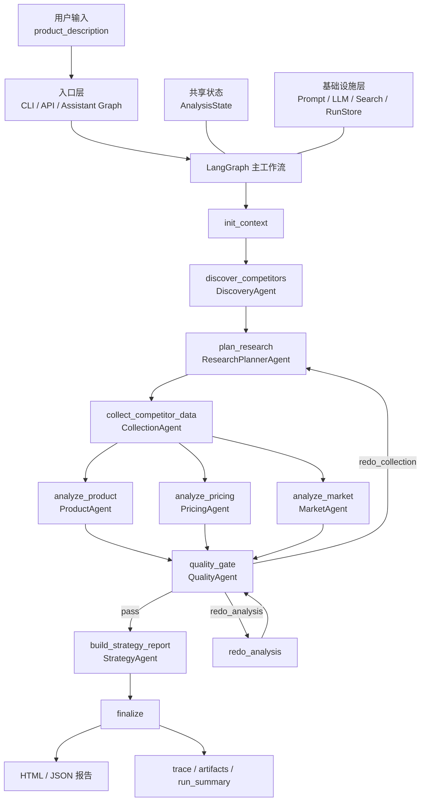

# competitor-analysis-mas-v2 项目整体解读

更新时间：2026-05-25

## 1. 项目是什么

这个项目本质上是一个基于 `LangGraph` 的多 Agent 竞品分析系统。

它不是让多个 Agent 自由聊天、自由协商，而是把竞品分析拆成一条固定工作流：

`输入产品描述 -> 发现竞品 -> 规划研究任务 -> 采集证据 -> 并行分析 -> 质量检查 -> 回流重跑 -> 输出策略报告`

## 1.1 架构图

核心入口和主编排位置：

- CLI 入口在 [main.py](</d:/学习作业/Agent_Learning/AI全栈挑战赛_agent竞品分析/agent竞品分析参考/competitor-analysis-mas-v2/main.py:29>)
- 工作流图定义在 [workflow/graph.py](</d:/学习作业/Agent_Learning/AI全栈挑战赛_agent竞品分析/agent竞品分析参考/competitor-analysis-mas-v2/workflow/graph.py:15>)
- 节点实现集中在 [workflow/nodes.py](</d:/学习作业/Agent_Learning/AI全栈挑战赛_agent竞品分析/agent竞品分析参考/competitor-analysis-mas-v2/workflow/nodes.py:67>)
- 共享状态定义在 [workflow/state.py](</d:/学习作业/Agent_Learning/AI全栈挑战赛_agent竞品分析/agent竞品分析参考/competitor-analysis-mas-v2/workflow/state.py:21>)

## 2. 总体架构

当前系统可以分成 4 层。

### 2.1 入口层

- `main.py`：命令行运行入口，负责读取参数、选择是否启用 LLM，然后调用主工作流 [main.py](</d:/学习作业/Agent_Learning/AI全栈挑战赛_agent竞品分析/agent竞品分析参考/competitor-analysis-mas-v2/main.py:29>)
- `api_server.py`：最小 HTTP 服务，支持创建 run、查看 run、查看 report 和 trace [api_server.py](</d:/学习作业/Agent_Learning/AI全栈挑战赛_agent竞品分析/agent竞品分析参考/competitor-analysis-mas-v2/api_server.py:25>)
- `agent.py`：暴露 LangGraph 图给平台使用，包括 `competitive_analysis_workflow` 和 `competitive_analysis_assistant` [agent.py](</d:/学习作业/Agent_Learning/AI全栈挑战赛_agent竞品分析/agent竞品分析参考/competitor-analysis-mas-v2/agent.py:4>)

### 2.2 编排层

编排层的核心是 `LangGraph StateGraph`。

主图定义在 [workflow/graph.py](</d:/学习作业/Agent_Learning/AI全栈挑战赛_agent竞品分析/agent竞品分析参考/competitor-analysis-mas-v2/workflow/graph.py:15>)，节点包括：

- `init_context`
- `discover_competitors`
- `plan_research`
- `collect_competitor_data`
- `analyze_product`
- `analyze_pricing`
- `analyze_market`
- `quality_gate`
- `redo_analysis`
- `build_strategy_report`
- `build_empty_report`
- `finalize`

其中最关键的结构有两个：

- `collect_competitor_data` 之后，同时进入 `analyze_product`、`analyze_pricing`、`analyze_market`
- `quality_gate` 之后，根据质检结果决定是回到采集、重跑分析，还是直接出报告 [workflow/nodes.py](</d:/学习作业/Agent_Learning/AI全栈挑战赛_agent竞品分析/agent竞品分析参考/competitor-analysis-mas-v2/workflow/nodes.py:291>)

### 2.3 状态层

整个系统通过一个共享状态对象传递数据，而不是主要靠 Agent 互发消息。

状态定义在 [workflow/state.py](</d:/学习作业/Agent_Learning/AI全栈挑战赛_agent竞品分析/agent竞品分析参考/competitor-analysis-mas-v2/workflow/state.py:21>)，核心字段包括：

- `product_description`
- `competitor_list`
- `research_tasks`
- `research_coverage`
- `research_evidence`
- `evidence_bundles`
- `competitors_data`
- `product_analysis`
- `pricing_analysis`
- `market_analysis`
- `qa_issues`
- `report`
- `report_paths`
- `trace_summary`
- `timings`

这说明它的真实架构更接近“黑板式工作流”，不是“对话式多智能体”。

### 2.4 基础设施层

- Prompt 模板加载在 [core/prompt_loader.py](</d:/学习作业/Agent_Learning/AI全栈挑战赛_agent竞品分析/agent竞品分析参考/competitor-analysis-mas-v2/core/prompt_loader.py:18>)
- LLM 调用封装在 [core/llm_client.py](</d:/学习作业/Agent_Learning/AI全栈挑战赛_agent竞品分析/agent竞品分析参考/competitor-analysis-mas-v2/core/llm_client.py:90>)
- 搜索封装在 [core/search_client.py](</d:/学习作业/Agent_Learning/AI全栈挑战赛_agent竞品分析/agent竞品分析参考/competitor-analysis-mas-v2/core/search_client.py:28>)
- 运行产物、trace、报告持久化在 [core/run_store.py](</d:/学习作业/Agent_Learning/AI全栈挑战赛_agent竞品分析/agent竞品分析参考/competitor-analysis-mas-v2/core/run_store.py:22>)

## 3. 主流程怎么跑

按执行顺序看，当前系统主链路如下。

### 3.1 初始化上下文

`init_context` 会生成 `run_id`、创建 `runs/<run_id>/trace|artifacts|report` 目录，并初始化整个运行状态 [workflow/nodes.py](</d:/学习作业/Agent_Learning/AI全栈挑战赛_agent竞品分析/agent竞品分析参考/competitor-analysis-mas-v2/workflow/nodes.py:71>)。

### 3.2 发现竞品

`discover_competitors` 调用 `DiscoveryAgent`：

- 先生成搜索关键词
- 再做批量搜索
- 再从搜索结果中筛出候选竞品

结果写入 `competitor_list.json` [workflow/nodes.py](</d:/学习作业/Agent_Learning/AI全栈挑战赛_agent竞品分析/agent竞品分析参考/competitor-analysis-mas-v2/workflow/nodes.py:119>)。

### 3.3 规划研究任务

`plan_research` 调用 `ResearchPlannerAgent`：

- 按竞品和主题拆研究任务
- 把 QA 打回的问题优先提升
- 形成结构化 `ResearchTask[]`

结果写入 `research_tasks.json` [workflow/nodes.py](</d:/学习作业/Agent_Learning/AI全栈挑战赛_agent竞品分析/agent竞品分析参考/competitor-analysis-mas-v2/workflow/nodes.py:154>)。

### 3.4 采集证据

`collect_competitor_data` 调用 `CollectionAgent`：

- 逐任务搜索
- 提取原始文本
- 建立 citation
- 生成主题摘要
- 汇总成竞品证据包和 coverage

这一步的核心产物包括：

- `competitors_data.json`
- `evidence_bundles.json`
- `research_coverage.json`

见 [workflow/nodes.py](</d:/学习作业/Agent_Learning/AI全栈挑战赛_agent竞品分析/agent竞品分析参考/competitor-analysis-mas-v2/workflow/nodes.py:183>)。

### 3.5 三路并行分析

采集完成后，同时进入三个分析节点：

- `analyze_product`
- `analyze_pricing`
- `analyze_market`

这三个节点分别调用 `ProductAgent`、`PricingAgent`、`MarketAgent`，并把结果写入对应 artifact [workflow/nodes.py](</d:/学习作业/Agent_Learning/AI全栈挑战赛_agent竞品分析/agent竞品分析参考/competitor-analysis-mas-v2/workflow/nodes.py:221>)。

### 3.6 质量检查

`quality_gate` 调用 `QualityAgent`，判断当前结果是否达到出报告标准 [workflow/nodes.py](</d:/学习作业/Agent_Learning/AI全栈挑战赛_agent竞品分析/agent竞品分析参考/competitor-analysis-mas-v2/workflow/nodes.py:248>)。

可能结果有三种：

- `pass`：直接出报告
- `redo_collection`：返回研究规划和证据采集
- `redo_analysis`：只重跑部分分析 Agent

### 3.7 生成报告

`build_strategy_report` 调用 `StrategyAgent`，把三份分析整合成最终 `StrategyReport` [workflow/nodes.py](</d:/学习作业/Agent_Learning/AI全栈挑战赛_agent竞品分析/agent竞品分析参考/competitor-analysis-mas-v2/workflow/nodes.py:335>)。

### 3.8 最终收口

`finalize` 会：

- 汇总 timings
- 汇总 llm logs
- 生成 HTML 报告
- 生成 JSON 报告
- 写出 run summary

见 [workflow/nodes.py](</d:/学习作业/Agent_Learning/AI全栈挑战赛_agent竞品分析/agent竞品分析参考/competitor-analysis-mas-v2/workflow/nodes.py:430>)。

## 4. 各个 Agent 的角色定义

### 4.1 DiscoveryAgent

位置：[agents/discovery_agent.py](</d:/学习作业/Agent_Learning/AI全栈挑战赛_agent竞品分析/agent竞品分析参考/competitor-analysis-mas-v2/agents/discovery_agent.py:17>)

职责：

- 理解用户输入的产品描述
- 生成搜索关键词
- 从搜索结果中识别核心竞品
- 输出竞品列表和相关性等级

输入：

- `product_description`
- `max_competitors`

输出：

- `CompetitorList` [models/domain.py](</d:/学习作业/Agent_Learning/AI全栈挑战赛_agent竞品分析/agent竞品分析参考/competitor-analysis-mas-v2/models/domain.py:51>)

本质角色：

它是系统的“问题边界确定器”，负责先把“分析对象是谁”定出来。

### 4.2 ResearchPlannerAgent

位置：[agents/research_planner_agent.py](</d:/学习作业/Agent_Learning/AI全栈挑战赛_agent竞品分析/agent竞品分析参考/competitor-analysis-mas-v2/agents/research_planner_agent.py:22>)

职责：

- 把竞品研究拆成原子任务
- 统一任务主题
- 根据 QA 缺口提升任务优先级

输入：

- `product_description`
- `competitor_list`
- `focus_topics`
- `qa_issues`
- `retry_count`

输出：

- `ResearchTask[]` [models/domain.py](</d:/学习作业/Agent_Learning/AI全栈挑战赛_agent竞品分析/agent竞品分析参考/competitor-analysis-mas-v2/models/domain.py:59>)

本质角色：

它不是分析者，而是“任务拆解器”和“采集计划生成器”。

补充说明：

虽然有 prompt 文件 [prompts/research_planner_agent.md](</d:/学习作业/Agent_Learning/AI全栈挑战赛_agent竞品分析/agent竞品分析参考/competitor-analysis-mas-v2/prompts/research_planner_agent.md:1>)，但当前代码实现里它主要是规则生成，不是真正依赖 LLM。

### 4.3 CollectionAgent

位置：[agents/collection_agent.py](</d:/学习作业/Agent_Learning/AI全栈挑战赛_agent竞品分析/agent竞品分析参考/competitor-analysis-mas-v2/agents/collection_agent.py:36>)

职责：

- 执行搜索
- 提取网页结果文本
- 生成 citation
- 汇总主题摘要
- 标注 coverage 是否完整

输入：

- `product_description`
- `ResearchTask[]`

输出：

- `research_evidence`
- `evidence_bundles`
- `research_coverage`
- `competitors_data`

本质角色：

它是整个系统的“证据工厂”，负责把外部信息转成后续分析可消费的结构化材料。

### 4.4 ProductAgent

位置：[agents/product_agent.py](</d:/学习作业/Agent_Learning/AI全栈挑战赛_agent竞品分析/agent竞品分析参考/competitor-analysis-mas-v2/agents/product_agent.py:38>)

职责：

- 生成功能对比矩阵
- 生成功能树
- 识别我方与各竞品的优劣势
- 提炼差异化功能点

输入：

- `product_name`
- `evidence_bundles`
- `competitors_data`

输出：

- `ProductAnalysis` [models/domain.py](</d:/学习作业/Agent_Learning/AI全栈挑战赛_agent竞品分析/agent竞品分析参考/competitor-analysis-mas-v2/models/domain.py:239>)

本质角色：

它回答的是“产品能力层面怎么比、差异点在哪里”。

### 4.5 PricingAgent

位置：[agents/pricing_agent.py](</d:/学习作业/Agent_Learning/AI全栈挑战赛_agent竞品分析/agent竞品分析参考/competitor-analysis-mas-v2/agents/pricing_agent.py:23>)

职责：

- 提取免费层、付费层
- 判断定价模型
- 提炼升级触发点
- 判断计费单位
- 总结定价风险和定价信号

输入：

- `product_name`
- `evidence_bundles`
- `competitors_data`

输出：

- `PricingAnalysis` [models/domain.py](</d:/学习作业/Agent_Learning/AI全栈挑战赛_agent竞品分析/agent竞品分析参考/competitor-analysis-mas-v2/models/domain.py:251>)

本质角色：

它回答的是“竞品怎么收费、收费方式说明了什么商业逻辑”。

### 4.6 MarketAgent

位置：[agents/market_agent.py](</d:/学习作业/Agent_Learning/AI全栈挑战赛_agent竞品分析/agent竞品分析参考/competitor-analysis-mas-v2/agents/market_agent.py:26>)

职责：

- 分析市场份额或相对位置
- 判断增长趋势
- 汇总用户口碑
- 分析渠道动作
- 生成用户画像

输入：

- `product_name`
- `evidence_bundles`
- `competitors_data`

输出：

- `MarketAnalysis` [models/domain.py](</d:/学习作业/Agent_Learning/AI全栈挑战赛_agent竞品分析/agent竞品分析参考/competitor-analysis-mas-v2/models/domain.py:263>)

本质角色：

它回答的是“市场格局怎么样、用户怎么看、渠道怎么打”。

### 4.7 QualityAgent

位置：[agents/quality_agent.py](</d:/学习作业/Agent_Learning/AI全栈挑战赛_agent竞品分析/agent竞品分析参考/competitor-analysis-mas-v2/agents/quality_agent.py:19>)

职责：

- 检查竞品数量够不够
- 检查 `FeatureTree` 是否存在
- 检查 `PricingModel` 是否存在
- 检查 `UserPersona` 是否存在
- 检查每条结论是否带 citation
- 检查 `coverage_gaps`
- 决定是否回流

输入：

- `product_analysis`
- `pricing_analysis`
- `market_analysis`
- `coverage`
- `qa_round`

输出：

- `issues`
- `next_action`

本质角色：

它是系统的“守门员”，负责不让结构不完整、证据不足的结果直接进入最终报告。

补充说明：

当前 `QualityAgent` 主要是规则检查，不是 LLM 审稿器 [agents/quality_agent.py](</d:/学习作业/Agent_Learning/AI全栈挑战赛_agent竞品分析/agent竞品分析参考/competitor-analysis-mas-v2/agents/quality_agent.py:27>)。

### 4.8 StrategyAgent

位置：[agents/strategy_agent.py](</d:/学习作业/Agent_Learning/AI全栈挑战赛_agent竞品分析/agent竞品分析参考/competitor-analysis-mas-v2/agents/strategy_agent.py:35>)

职责：

- 综合产品、定价、市场三份分析
- 输出整体定位
- 输出差异化策略
- 输出行动计划
- 输出风险评估
- 渲染文本报告和 HTML 报告

输入：

- `product_name`
- `competitor_count`
- `product_analysis`
- `pricing_analysis`
- `market_analysis`

输出：

- `StrategyReport` [models/domain.py](</d:/学习作业/Agent_Learning/AI全栈挑战赛_agent竞品分析/agent竞品分析参考/competitor-analysis-mas-v2/models/domain.py:311>)

本质角色：

它是最终“汇总决策 Agent”，负责把三维分析收束成可执行策略。

## 5. 数据模型怎么分层

这个项目的数据模型已经不是松散字典，而是比较明确的领域模型。

关键模型位置在 [models/domain.py](</d:/学习作业/Agent_Learning/AI全栈挑战赛_agent竞品分析/agent竞品分析参考/competitor-analysis-mas-v2/models/domain.py:1>)。

可以按 5 类理解：

- 竞品发现层：`CompetitorInfo`、`CompetitorList`
- 研究任务层：`ResearchTask`、`ResearchCoverage`、`CoverageGap`
- 证据层：`Citation`、`ResearchEvidence`、`EvidenceBundle`
- 分析层：`ProductAnalysis`、`PricingAnalysis`、`MarketAnalysis`
- 报告层：`QAIssue`、`ActionItem`、`StrategyReport`

这套模型的意义很直接：

- 前面节点负责把信息逐步结构化
- 中间节点负责把结构化证据转成判断
- 最后节点负责把判断转成策略报告

## 6. Assistant 图是什么

除了主分析图，项目里还有一个平台入口图。

定义在 [workflow/platform_graph.py](</d:/学习作业/Agent_Learning/AI全栈挑战赛_agent竞品分析/agent竞品分析参考/competitor-analysis-mas-v2/workflow/platform_graph.py:30>)，主要用于：

- 从消息里取出用户输入
- 如果没有输入，就提示补充描述
- 如果有输入，就调用主分析图
- 最后把结果格式化成平台可读回复

对应状态定义在 [workflow/platform_state.py](</d:/学习作业/Agent_Learning/AI全栈挑战赛_agent竞品分析/agent竞品分析参考/competitor-analysis-mas-v2/workflow/platform_state.py:19>)。

所以项目实际上有两个图：

- `competitive_analysis_workflow`：主业务图
- `competitive_analysis_assistant`：平台对话入口图

## 7. 当前架构的真实特点

从第一性原理看，当前系统的几个核心特点是：

- 它是固定流程型系统，不是开放式 Agent 社会
- 它是共享状态驱动，不是消息驱动为主
- 它最核心的价值不在“有很多 Agent”，而在“把竞品分析分层拆开并且可回流”
- 它真正的工程亮点是 `QA 回流 + trace/artifact 落盘 + HTML 报告输出`

换句话说，这个项目现在最准确的定位不是“花哨的多智能体演示”，而是：

**一个带质量门控和可追踪产物的竞品分析流水线。**

## 8. 一句话总结

当前项目架构已经很清楚：`LangGraph` 负责编排，`AnalysisState` 负责共享状态，各个 Agent 各司其职，`QualityAgent` 负责回流控制，`StrategyAgent` 负责最终收口。

如果再用一句更短的话说，就是：**先找竞品，再找证据，再做三维分析，最后做策略收束。**
